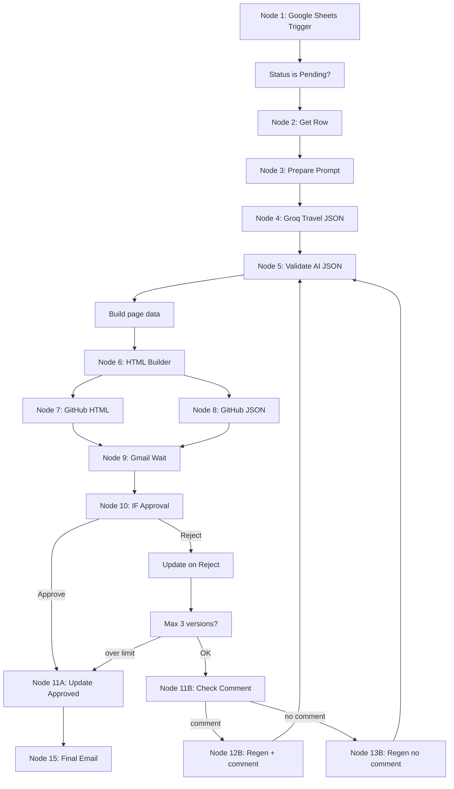

# Homework 3 — AI Travel Page Generator (n8n)

**Student:** Dor Dotan · Web Platforms Development — 10266  
**Overview page:** [index.html](./index.html)  
**Import workflow:** [workflow/travel-page-automation.json](./workflow/travel-page-automation.json)

**Stack:** n8n · Google Sheets · Groq (free) · Gmail · GitHub · OpenStreetMap · Unsplash (no API key)

---

## Table of contents

1. [Full workflow architecture](#1-full-workflow-architecture)
2. [Google Sheets structure](#2-google-sheets-structure)
3. [Required external services](#3-required-external-services)
4. [Required API keys and credentials](#4-required-api-keys-and-credentials)
5. [n8n node-by-node implementation](#5-n8n-node-by-node-implementation)
6. [Groq AI prompts](#6-groq-ai-prompts)
7. [HTML template](#7-html-template)
8. [GitHub configuration](#8-github-configuration)
9. [Gmail approval configuration](#9-gmail-approval-configuration)
10. [Rejection logic](#10-rejection-logic)
11. [Tester / checker instructions](#11-tester--checker-instructions)
12. [Final slide content](#12-final-slide-content)

---

## 1. Full workflow architecture

### 1.1 End-to-end flow

The automation follows the course pattern:

**Trigger → Google Sheets → AI → HTML generation → GitHub backup → Gmail approval → IF decision → update Google Sheets → final email**

### 1.2 Execution phases

| Phase | What happens |
|-------|----------------|
| **A — Trigger** | User enters `CityOrCountry` + `UserEmail` and sets `Status` = `Pending` in Google Sheets. |
| **B — Generate** | Groq returns structured JSON. Code validates fields, builds 3 image URLs, map embed, and responsive HTML. |
| **C — Backup** | Every execution commits `travel-pages/city-vN-timestamp.html` and `backups/city-vN-timestamp.json` to GitHub. |
| **D — Approve** | Gmail **Send and Wait for Response** with custom form: Approve / Reject + optional Comment. |
| **E — Branch** | IF reads decision. Approved → update sheet + confirmation email. Rejected → increment version → regen loop (max 3 versions). |

### 1.3 Paid vs free AI

| Provider | Model | Cost | Where used |
|----------|-------|------|------------|
| **Groq** | `llama-3.3-70b-versatile` | **Free tier** | Nodes 4, 12B, 13B (all AI calls) |
| OpenAI | `gpt-4o-mini` | Paid (optional) | Not used — swap URL/credential only if Groq unavailable |

**No paid model is required** for this assignment.

---

## 2. Google Sheets structure

**Sheet link:** https://docs.google.com/spreadsheets/d/1039zHFjCtQtrnEgMc5bQ2wpKAJw-SABn5X9v4So_HKA/edit?usp=sharing  
**Tab:** `Sheet1` (see [google-sheets/SETUP.md](./google-sheets/SETUP.md))

### Exact columns (row 1 = headers)

| Column | Header | Used for |
|--------|--------|----------|
| A | **ID** | Unique request id; matched when updating rows |
| B | **CityOrCountry** | User input — destination name (triggers content) |
| C | **UserEmail** | User input — approval email recipient |
| D | **Status** | Workflow state: `Pending` → `Generating` → `AwaitingApproval` → `Approved` / `Regenerating` / `Error` |
| E | **GeneratedHTML** | URL to view approved HTML (GitHub raw link) |
| F | **GitHubHTMLLink** | GitHub commit/file URL for HTML backup |
| G | **GitHubJSONBackupLink** | GitHub commit/file URL for JSON metadata backup |
| H | **MapLink** | OpenStreetMap link embedded in the page |
| I | **Attractions** | JSON string of attraction names and details |
| J | **Coordinates** | JSON string of lat/lng per attraction |
| K | **UserComment** | Rejection comment from Gmail form (if any) |
| L | **Version** | Page version (starts at 1; +1 on each rejection) |
| M | **CreatedAt** | ISO timestamp — set on first workflow run |
| N | **UpdatedAt** | ISO timestamp — updated on every sheet write |

### Status values

| Status | Meaning |
|--------|---------|
| `Pending` | **Triggers workflow** — user wants a new page |
| `Generating` | Workflow started |
| `AwaitingApproval` | Email sent; waiting for user |
| `Approved` | User approved; all links saved |
| `Regenerating` | User rejected; new version being built |
| `Error` | Max 3 versions exceeded or fatal failure |

---

## 3. Required external services

| Service | Role in workflow |
|---------|------------------|
| **n8n** | Orchestration platform (cloud at [n8n.io](https://n8n.io) or self-hosted `localhost:5678`) |
| **Google Sheets** | Data source + output store for status, links, metadata |
| **Groq** | Free LLM API — generates travel JSON content |
| **Gmail** | Sends approval email; **Send and Wait for Response** collects Approve/Reject + comment |
| **GitHub** | Backs up HTML + JSON on every execution (required GitHub node in flow) |
| **OpenStreetMap** | Free map embed + links (no API key) |
| **Unsplash Source** | Free image URLs from search terms (`source.unsplash.com`) — no API key |
| **Wikimedia** | Optional fallback image URLs (Groq can suggest Commons URLs in prompts) |

---

## 4. Required API keys and credentials

### 4.1 Groq API key

1. Sign up at [console.groq.com](https://console.groq.com).
2. **API Keys** → Create → copy `gsk_...`.
3. n8n → **Credentials** → **Header Auth**:
   - Name: `Authorization`
   - Value: `Bearer gsk_YOUR_KEY`
4. Attach to HTTP Request nodes: Node 4, 12B, 13B.

### 4.2 Google Sheets credentials

1. [Google Cloud Console](https://console.cloud.google.com) → new project.
2. Enable **Google Sheets API** + **Google Drive API**.
3. OAuth consent screen → External → add your Gmail as test user.
4. Credentials → **OAuth client ID** (Desktop or Web) → copy Client ID + Secret.
5. n8n → **Google Sheets OAuth2** → paste → **Connect** → authorize.
6. Used in: Trigger, Get Row, all Update nodes.

### 4.3 Gmail credentials

1. Same Google Cloud project → enable **Gmail API**.
2. n8n → **Gmail OAuth2** → same Client ID/Secret → Connect sending account.
3. Used in: Node 9 (Send and Wait), Node 15 (confirmation), max-regen email.

### 4.4 GitHub personal access token

1. GitHub → Settings → Developer settings → **Personal access tokens** → Tokens (classic).
2. Generate → scope **`repo`** (full control of private repos).
3. n8n → **GitHub API** credential → paste token.
4. Used in: Node 7, Node 8.

### 4.5 Optional keys

| Service | Needed? | Notes |
|---------|---------|-------|
| Google Maps API | No | OpenStreetMap used instead |
| Unsplash API | No | `source.unsplash.com` used |
| Wikimedia | No | Static Commons URLs if added in prompts |

### 4.6 Credential checklist

| Service | n8n credential | Nodes |
|---------|----------------|-------|
| Groq | Header Auth | 4, 12B, 13B |
| Google Sheets | Google Sheets OAuth2 | 1, 2, 11A, reject/update nodes |
| Gmail | Gmail OAuth2 | 9, 15, max-regen email |
| GitHub | GitHub API | 7, 8 |

---

## 5. n8n node-by-node implementation

Replace `REPLACE_GITHUB_OWNER` and `REPLACE_REPO` after import.

### Node 1 — Google Sheets Trigger

| | |
|---|---|
| **Type** | Google Sheets Trigger |
| **Purpose** | Start when a row is added or updated (user sets `Status` = `Pending`) |
| **Config** | Document ID: `1039zHFjCtQtrnEgMc5bQ2wpKAJw-SABn5X9v4So_HKA` · Sheet: `Sheet1` · Event: Row Updated · Poll: every 1 min |
| **Input** | Sheet change event |
| **Output** | Full row (`ID`, `CityOrCountry`, `UserEmail`, `Status`, …) |
| **Next** | → `Status is Pending?` |

### Node 2 — Google Sheets Get Row

| | |
|---|---|
| **Type** | Google Sheets (Read) |
| **Purpose** | Reload row by `ID` for fresh data |
| **Config** | Filter: `ID` = `{{ $json.ID }}` |
| **Input** | Trigger / status filter output |
| **Output** | Single row object |
| **Next** | → Node 3 |

### Node 3 — Set / Prepare Prompt

| | |
|---|---|
| **Type** | Set |
| **Purpose** | Prepare structured prompt fields for Groq |
| **Config** | `promptLocation`, `promptVersion`, `promptSystem`, `promptUser` (see Section 6) |
| **Input** | Sheet row |
| **Output** | Row + prompt fields |
| **Next** | → Node 4 |

### Node 4 — Groq AI — Travel Data Generator

| | |
|---|---|
| **Type** | HTTP Request |
| **Purpose** | Generate structured JSON: title, intro, attractions, coordinates, image terms, map center, SEO fields |
| **Config** | POST `https://api.groq.com/openai/v1/chat/completions` · Model `llama-3.3-70b-versatile` · `response_format: json_object` |
| **Input** | Prompt from Node 3 |
| **Output** | `choices[0].message.content` (JSON string) |
| **Next** | → Node 5 |

### Node 5 — Validate AI JSON

| | |
|---|---|
| **Type** | Code (JavaScript) |
| **Purpose** | Parse Groq JSON; validate required fields; create safe fallbacks if missing |
| **Input** | Groq response OR regen Groq response |
| **Output** | Normalized `title`, `introduction`, `attractions[]`, `coordinates[]`, `imageSearchTerms[]`, `mapCenter`, `version` |
| **Code** | [workflow/code-snippets/validate-ai-json.js](./workflow/code-snippets/validate-ai-json.js) |
| **Next** | → Build page data |

### Build page data (support node)

| | |
|---|---|
| **Type** | Code |
| **Purpose** | Build Unsplash image URLs, OSM map embed, file paths `travel-pages/` and `backups/` |
| **Output** | `htmlFilePath`, `jsonFilePath`, `mapLink`, `coordinates`, `metadata` |
| **Code** | [workflow/code-snippets/build-page-data.js](./workflow/code-snippets/build-page-data.js) |
| **Next** | → Node 6 |

### Node 6 — HTML Builder

| | |
|---|---|
| **Type** | Code |
| **Purpose** | Create complete responsive HTML from validated JSON |
| **Input** | Build page data |
| **Output** | `html`, `githubRawUrl`, `metadata` |
| **Template** | Inline in workflow; full version: [templates/travel-page-template.html](./templates/travel-page-template.html) |
| **Next** | → Node 7 + Node 8 (parallel) |

### Node 7 — GitHub Upload HTML

| | |
|---|---|
| **Type** | GitHub → File → Create |
| **Purpose** | Backup HTML every execution |
| **Config** | Path: `={{ $json.htmlFilePath }}` → `travel-pages/city-v1-timestamp.html` |
| **Output** | `commit.html_url` |
| **Next** | → Merge GitHub outputs |

### Node 8 — GitHub Upload JSON Backup

| | |
|---|---|
| **Type** | GitHub → File → Create |
| **Purpose** | Backup metadata JSON every execution |
| **Config** | Path: `backups/city-v1-timestamp.json` · Content: `JSON.stringify(metadata)` |
| **Output** | `commit.html_url` |
| **Next** | → Merge GitHub outputs |

### Node 9 — Gmail Send and Wait for Response

| | |
|---|---|
| **Type** | Gmail → Send and Wait |
| **Purpose** | Email preview link; collect Approve/Reject + Comment |
| **Config** | Custom form: Decision (Approve/Reject), Comment (optional text) |
| **Output** | `data.Decision`, `data.Comment` |
| **Next** | → Node 10 |

### Node 10 — IF Approval Check

| | |
|---|---|
| **Type** | IF |
| **Condition** | `{{ $json.data.Decision === 'Approve' }}` |
| **True** | → Node 11A |
| **False** | → Update sheet on Reject |

### Node 11A — If Approved — Update Google Sheets

| | |
|---|---|
| **Type** | Google Sheets → Update |
| **Saves** | `Status=Approved`, `GeneratedHTML`, `GitHubHTMLLink`, `GitHubJSONBackupLink`, `MapLink`, `Attractions`, `Coordinates`, `UserComment`, `UpdatedAt` |
| **Next** | → Node 15 |

### Node 11B — If Rejected — Check Comment

| | |
|---|---|
| **Type** | Switch |
| **Rule 1** | Comment not empty → Node 12B |
| **Default** | No comment → Node 13B |

### Node 12B — Regenerate With Comment

| | |
|---|---|
| **Type** | HTTP Request (Groq) |
| **Purpose** | Send user comment + previous JSON back to AI |
| **Next** | → Node 5 (loop) |

### Node 13B — Regenerate Without Comment

| | |
|---|---|
| **Type** | HTTP Request (Groq) |
| **Purpose** | Generate alternative page for same location |
| **Next** | → Node 5 (loop) |

### Node 14 — Loop back

Regeneration paths connect to **Node 5 → Build page data → Node 6 → GitHub → Gmail → Node 10** again.

### Node 15 — Final Gmail Confirmation

| | |
|---|---|
| **Type** | Gmail → Send |
| **When** | Approved branch only |
| **Body** | Final HTML link, GitHub HTML link, GitHub JSON link, sheet row ID |

### Extra nodes

| Node | Purpose |
|------|---------|
| `Status is Pending?` | IF filter: Status=Pending, CityOrCountry and UserEmail not empty |
| `Set status Generating` | Sets Status + CreatedAt on start |
| `Set AwaitingApproval` | After GitHub backup, before email |
| `Max regenerations reached?` | IF Version+1 > 3 → Error email |
| `Update sheet on Reject` | Status=Regenerating, Version+1, UserComment |

---

## 6. Groq AI prompts

Full copy-paste prompts: **[prompts/groq-prompts.md](./prompts/groq-prompts.md)**

### A — Travel content generation (Node 4)

**System:** Professional travel writer; output ONLY valid JSON; real WGS84 coordinates; ≥4 attractions; 3 `imageSearchTerms`.

**User:** Create content for `{{ CityOrCountry }}` with schema: `title`, `locationTitle`, `country`, `introduction`, `travelRecommendations[5]`, `attractions[]`, `imageSearchTerms[3]`, `mapCenter`, `seoTitle`, `shortSummary`.

### B — HTML page generation (optional)

Prefer **Code + template** (Node 6). Prompt C in prompts file if you want Groq to return full HTML instead.

### C — Regeneration after rejection **with comment** (Node 12B)

**System:** Apply user feedback; same JSON schema; keep geographic accuracy.

**User:** Destination + `UserComment` + `Previous JSON` + new `Version`.

### D — Regeneration after rejection **without comment** (Node 13B)

**System:** Produce noticeably DIFFERENT content: new attractions, intro angle, image terms.

**User:** Destination + `Previous JSON` + new `Version`; no user comment.

All responses use `"response_format": { "type": "json_object" }`.

---

## 7. HTML template

Full responsive template with embedded CSS:

**File:** [templates/travel-page-template.html](./templates/travel-page-template.html)

**Includes:**

- Hero section with location title
- Introduction
- 3 image cards (gallery grid)
- Attraction cards with coordinates
- Embedded OpenStreetMap iframe
- Coordinates table
- Footer
- Mobile-first responsive layout (`@media max-width: 600px`)

**Placeholders:** `{{TITLE}}`, `{{HERO_IMAGE}}`, `{{INTRO}}`, `{{RECOMMENDATIONS}}`, `{{IMAGES_HTML}}`, `{{ATTRACTIONS_HTML}}`, `{{MAP_EMBED}}`, `{{COORDS_ROWS}}`, `{{YEAR}}`

Node 6 replaces placeholders or uses equivalent inline HTML in the workflow JSON.

---

## 8. GitHub configuration

### 8.1 Create repository

1. GitHub → **New repository** → e.g. `afeka_dotan` or `n8n-travel-backups`.
2. Create folders `travel-pages/` and `backups/` (or let first commit create them).

### 8.2 Personal access token

- Scopes: **`repo`**
- Store only in n8n GitHub credential

### 8.3 n8n GitHub credential

Credentials → **GitHub API** → Access Token → Save as `GitHub – Travel Backup`.

### 8.4 File naming

| Type | Path pattern |
|------|----------------|
| HTML | `travel-pages/city-name-v{version}-yyyy-MM-dd-HH-mm-ss.html` |
| JSON | `backups/city-name-v{version}-yyyy-MM-dd-HH-mm-ss.json` |

### 8.5 Public preview links

| Method | URL pattern |
|--------|-------------|
| Raw file (works immediately) | `https://raw.githubusercontent.com/OWNER/REPO/main/travel-pages/...html` |
| GitHub Pages (optional) | Enable Pages from `main` branch → `https://OWNER.github.io/REPO/travel-pages/...html` |

Update `REPLACE_GITHUB_OWNER` / `REPLACE_REPO` in Node 6 and GitHub nodes.

---

## 9. Gmail approval configuration

### 9.1 Credential

n8n → **Gmail OAuth2** → connect account that sends approval emails.

### 9.2 Send and Wait for Response (Node 9)

| Setting | Value |
|---------|-------|
| Operation | Send and Wait |
| To | `{{ UserEmail }}` |
| Subject | `Approve travel page: {location} (v{version})` |
| Body | HTML with GitHub preview link |
| Response type | **Custom form** |
| Field 1 | Decision — dropdown: Approve / Reject |
| Field 2 | Comment — text, optional |
| Wait limit | 7 days |

### 9.3 User actions

| Action | Workflow path |
|--------|---------------|
| **Approve** | Node 11A → Node 15 |
| **Reject + comment** | Node 12B → regen loop |
| **Reject, no comment** | Node 13B → regen loop |

### 9.4 Alternative if comment not supported

Use **Approval** response type for Approve/Disapprove only; add a second **Gmail Trigger** or **Webhook** for comments, or instruct users to reply to the email and parse replies (advanced). **Custom form** is the recommended approach in this workflow.

---

## 10. Rejection logic

### Reject with comment

1. User selects **Reject** and fills **Comment**.
2. Sheet: `Status=Regenerating`, `Version+1`, `UserComment` saved.
3. Node 12B sends comment + previous JSON to Groq.
4. Node 5 → 6 → 7 → 8 → 9 loop.

### Reject without comment

1. User selects **Reject**, leaves Comment empty.
2. Same sheet update.
3. Node 13B asks Groq for a different alternative page.
4. Same loop back.

### Version increment

- `Version` starts at `1`.
- Each rejection sets `Version = previous + 1` before regen.

### Loop limit (max 3 versions)

After reject, IF `Version + 1 > 3`:

- Set `Status = Error`
- Send notification email
- Stop regeneration

This allows versions 1, 2, and 3 to be emailed; a 4th rejection stops the loop.

---

## 11. Tester / checker instructions

### Step 1 — Import workflow

1. Open n8n (`https://app.n8n.io` or `http://localhost:5678`).
2. **Workflows** → **Import from File** → `hw3/workflow/travel-page-automation.json`.

### Step 2 — Connect credentials

| Credential | Attach to |
|------------|-----------|
| Groq Header Auth | Nodes 4, 12B, 13B |
| Google Sheets OAuth2 | All Google Sheets nodes |
| Gmail OAuth2 | Nodes 9, 15, max-regen email |
| GitHub API | Nodes 7, 8 |

### Step 3 — Configure GitHub

Replace `REPLACE_GITHUB_OWNER` and `REPLACE_REPO` in Node 6, 7, 8.

### Step 4 — Open Google Sheet

https://docs.google.com/spreadsheets/d/1039zHFjCtQtrnEgMc5bQ2wpKAJw-SABn5X9v4So_HKA/edit?usp=sharing

Ensure headers match Section 2.

### Step 5 — Add test row

| CityOrCountry | UserEmail | Status | Version |
|---------------|-----------|--------|---------|
| `Prague, Czech Republic` | your@email.com | `Pending` | `1` |

### Step 6 — Activate workflow

Toggle **Active** ON. Wait ~1 minute for poll or **Execute workflow** manually.

### Step 7 — Approve test

1. Open approval email → **Approve**.
2. Verify sheet: `Status=Approved`, links in `GeneratedHTML`, `GitHubHTMLLink`, `GitHubJSONBackupLink`, `Coordinates`.
3. Open HTML link — confirm 3+ images, map, attractions.

### Step 8 — Reject tests

- **With comment:** Reject + "Add more food tips" → version 2 email.
- **Without comment:** Reject only → different content, version increments.

### Step 9 — Verify GitHub

Repo → `travel-pages/` and `backups/` → files named `prague-czech-republic-v1-...`.

### Step 10 — Verify n8n executions

**Executions** tab → each run should show GitHub nodes succeeded.

---

## 12. Final slide content

Copy-paste ready slide: **[SUBMISSION_SLIDES.md](./SUBMISSION_SLIDES.md)**

---

## Known issues

| Issue | Workaround |
|-------|------------|
| Groq 429 rate limit | Add Wait node 2s before Groq |
| Unsplash blocked | Use Wikimedia URLs in Groq prompt |
| Gmail form on mobile | Test on desktop |
| Trigger misses row | Status must be exactly `Pending` |
| GitHub 422 duplicate file | Filename includes seconds timestamp |

---

## Quick start checklist

- [ ] Create Google Sheet with columns from Section 2
- [ ] Groq + Google + Gmail + GitHub credentials in n8n
- [ ] Import `workflow/travel-page-automation.json`
- [ ] Replace GitHub owner/repo placeholders
- [ ] Activate workflow → set row to `Pending`
- [ ] Screenshot HTML + n8n canvas for submission
